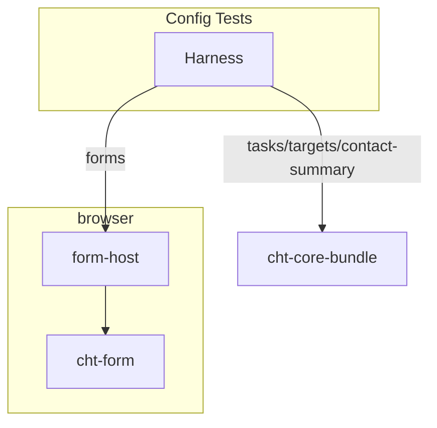

# Contributing

The Community Health Toolkit is powered by people like you. Your contributions help us create open source technology for a new model of healthcare that reaches everyone.

## Submitting code

> We recommend you raise an issue on Github or start a conversation on our [Community Forum](https://forum.communityhealthtoolkit.org) about the change you want to make before you start on code.

- Read our [Development Workflow](https://docs.communityhealthtoolkit.org/contribute/code/workflow/) to understand how we work, and review our [Code Style Guide](https://docs.communityhealthtoolkit.org/contribute/code/style-guide/) before you begin.
  - Note that the "Project States" section does not apply to changes made to `cht-conf-test-harness` 
- Make the code change.
  - Include tests for any new/updated logic.
    - Include the issue/PR number in the test title. This provides context for future debugging if the test ever regresses.
  - Update the project's version number in the [package.json](./package.json) by running `npm version <major|minor|patch>`
- Before you submit a pull request, please make sure your contribution passes all tests. Test failures need to be addressed before we can merge your contribution.
  - You can run `npm run travis` to build the project, lint the source code, and execute the tests.
- Provide detail about the issue you are solving in the pull request description. Note: If your pull request addresses a specific issue, please reference it using medic/<repo>#<issue number>
- Our CI will automatically schedule a build; monitor the build to ensure it passes.
- Your PR will be reviewed by one of the repository's maintainers. Most PRs have at least one change requested before they're merged so don't be offended if your change doesn't get accepted on the first try!

### Code of Conduct

All maintainers and contributors are required to act according to our [Code of Conduct](https://github.com/medic/cht-core/blob/master/CODE_OF_CONDUCT.md). Thank you for your help building a positive community and a safe environment for everyone.

#### License
The software is provided under AGPL-3.0. Contributions to this project are accepted under the same license.

## Architecture

The test harness leverages subsets of the actual cht-core code to recreate a close approximation of the production environment.

- `Harness` - Simple api from cht-conf-test-harness for running config tests
- `form-host` - Browser-side shim for integrating with cht-form
- `cht-form` - Renders ODK forms. Built from cht-core/webapp.
- `cht-core-bundle` - A bundle of code from cht-core used for calculating tasks, targets, and contact summaries. Also used to convert forms to xforms.

## Maintaining CHT Artifacts

### Adding new cht-core version

Code for each CHT version is stored in [`cht-bundles`](./cht-bundles). To add a new version:

1. Create a new folder in `cht-bundles` with the name of the version you want to add (e.g. `cht-core-5-0`).
    1. Inside this folder create `bundle.js` and `xsl-paths.js` files following the pattern of the other versions.
    1. Update the contents of these files to point to the (non-existent) `build` directory of the cht-core version you want to add. This build directory will be created/populated later.
1. Update the [`all-chts-bundle.js`](./cht-bundles/all-chts-bundle.js) file to include the new version.
    1. Note that the key given here will represent the value consumers should set in the `coreVersion` field of their harness configuration.
1. Update the [`build.sh`](./build.sh) script to include the new version in the `cht_versions` map. Include the exact commit hash to use for the version. 
1. Run `npm run build` to create the new artifacts.
1. Update the [`harness.defaults.json` config](./test/collateral/harness.defaults.json) so that `coreVersion` points to the new version.
    1. Run `npm run test` to ensure the new artifacts are working as expected.
1. Do not forget to commit the newly generated contents of `./dist`!

### Updating existing cht-core artifacts

It is not necessary to rebuild the cht-core artifacts for every change to the cht-conf-test-harness code. Many changes to the harness logic should be passive in regard to the cht-core integration and running `npm run build` should be sufficient to rebuild only the required artifacts.

By default, the build script will not re-build the cht-core artifacts in the `dist/cht-core-x-x` directories if they already exist. To rebuild a particular version, delete the `dist/cht-core-x-x` directory before running the build script. To force a rebuild of all versions, you can run the `build.sh` script with the `--force` flag. Rebuilding the existing cht-core artifacts should only be necessary if changes to the harness logic require changes to the cht-core integration (e.g. pulling in additional logic from the cht-core code).
